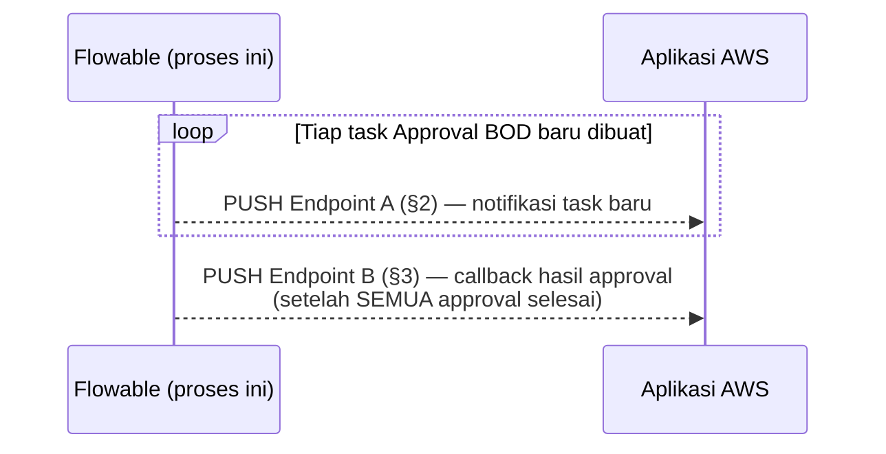

# Kontrak API — Endpoint Aplikasi AWS (Proses "Approval Berita Acara")

## Daftar Isi

1. [Ringkasan — dua endpoint yang harus dibangun](#1-ringkasan--dua-endpoint-yang-harus-dibangun)
2. [Endpoint A — Notifikasi Task Baru](#2-endpoint-a--notifikasi-task-baru)
   - 2.1. [Skema body request](#21-skema-body-request)
   - 2.2. [Sifat penting yang wajib dipahami](#22-sifat-penting-yang-wajib-dipahami)
3. [Endpoint B — Callback Hasil Approval](#3-endpoint-b--callback-hasil-approval)
   - 3.1. [Skema body request](#31-skema-body-request)
   - 3.2. [Sifat penting yang wajib dipahami](#32-sifat-penting-yang-wajib-dipahami)
4. [Risiko & hal yang belum teruji di server produksi](#4-risiko--hal-yang-belum-teruji-di-server-produksi)
5. [Cara mengganti URL placeholder setelah kontrak tersedia](#5-cara-mengganti-url-placeholder-setelah-kontrak-tersedia)

Checklist implementasi & pengujian lengkap (membangun kedua endpoint,
mengganti URL, uji end-to-end) ada di
[KONTRAK-API-FLOWABLE.md §6](./KONTRAK-API-FLOWABLE.md#6-catatan-implementasi--risiko-terkait)
bersama item checklist PULL & Complete Task — checklist digabung di satu
tempat supaya tim Aplikasi AWS tidak perlu buka dua file untuk menyusun rencana
kerja lengkap.

---

## 1. Ringkasan — dua endpoint yang harus dibangun

Proses "Approval Berita Acara" memicu **2 HTTP callback PUSH** ke
Agreement Workflow System — selanjutnya disebut **Aplikasi AWS**
(bukan Amazon Web Services — kebetulan sama singkatannya) — lewat
mekanisme Flowable `flowable:taskListener`/`flowable:type="http"`.
Kedua endpoint di bawah ini **harus dibangun & di-hosting oleh Aplikasi
AWS** — Flowable hanya memanggilnya (klien), tidak menyediakannya:

| No. | Endpoint | Dipicu dari | Kapan |
|---|---|---|---|
| 1 | [§2 Endpoint A](#2-endpoint-a--notifikasi-task-baru) — Notifikasi Task Baru | Task Listener `UserTask_ApprovalBod` | Setiap task Approval BOD baru dibuat (berkali-kali per instance, paralel) |
| 2 | [§3 Endpoint B](#3-endpoint-b--callback-hasil-approval) — Callback Hasil Approval | Service Task `ServiceTask_CallbackHasil` | Sekali per instance, setelah SEMUA approval selesai |

Push ini **sengaja dijalankan dual-channel** bersama PULL (kesepakatan
RINGKASAN-PEMBAHASAN.md Update 3): push memberi kecepatan (real-time),
PULL (dijelaskan lengkap di
[KONTRAK-API-FLOWABLE.md](./KONTRAK-API-FLOWABLE.md#3-endpoint-pull-polling-task))
jadi jaring pengaman kalau push gagal terkirim (jaringan putus, endpoint
Aplikasi AWS sedang down, dsb.) — jadi Aplikasi AWS **tidak boleh
mengandalkan push sebagai satu-satunya sumber kebenaran**. Mekanisme
pemicu push ini sudah diimplementasikan penuh di sisi BPMN; yang masih
PLACEHOLDER cuma URL tujuannya — itulah "2 kontrak API" yang harus
dibangun. Dokumen ini beberapa kali menyebut **Studio ini** — maksudnya
BPMN/DMN Studio Vue, aplikasi editor diagram terpisah yang dipakai untuk
membuat/mengelola diagram proses ini (dibahas lengkap di `README.md`),
BUKAN bagian dari kontrak API yang harus dibangun Aplikasi AWS.



---

## 2. Endpoint A — Notifikasi Task Baru

**Dipicu dari:** `flowable:taskListener` event `create` pada `UserTask_ApprovalBod` (baris ~361–385 di `examples/approval-berita-acara.bpmn`)

**Kapan terpicu:** Setiap kali SATU instance task Approval BOD dibuat — untuk multi-instance paralel, ini terpicu **berkali-kali per process instance** (satu kali per approver/candidate group dalam `dynamicApproverGroups`)

**Method:** `POST`

**URL:** PLACEHOLDER saat ini: `https://aplikasi-utama.contoh/api/notifikasi/task-baru` — **ganti dengan URL asli endpoint Aplikasi AWS**

**Header:** `Content-Type: application/json`

**Timeout klien:** 5 detik connect + 5 detik read (di-hardcode di script listener)

**Respons diharapkan:** **Tidak diperiksa sama sekali** oleh Flowable — script listener memanggil `conn.getResponseCode()` semata-mata untuk memaksa request selesai terkirim (flush), nilainya tidak dibaca/dicek. Disarankan tetap mengembalikan `2xx` secepatnya (endpoint ini dipanggil sinkron dari dalam transaksi `taskListener` — lihat [§4](#4-risiko--hal-yang-belum-teruji-di-server-produksi) soal implikasi latensinya) dan tidak perlu balikan body apa pun

### 2.1. Skema body request

Semua field string:

```json
{
  "taskId": "string",
  "processInstanceId": "string",
  "candidateGroup": "string",
  "taskName": "string"
}
```

**Contoh nyata:**

```json
{
  "taskId": "7a3f9c2e-1234-4abc-9def-0123456789ab",
  "processInstanceId": "4b8e1d0a-5678-4cde-8f01-23456789abcd",
  "candidateGroup": "2",
  "taskName": "Approval BOD"
}
```

| No. | Field | Keterangan |
|---|---|---|
| 1 | `taskId` | ID task Flowable ini, dipakai Aplikasi AWS untuk query detail lengkap lewat PULL kalau perlu (lihat [KONTRAK-API-FLOWABLE.md §3](./KONTRAK-API-FLOWABLE.md#3-endpoint-pull-polling-task)) — payload ini **sengaja minim**, bukan detail lengkap |
| 2 | `processInstanceId` | Untuk mengaitkan notifikasi ke process instance yang sama |
| 3 | `candidateGroup` | Key BOD approver individu untuk instance task ini (satu elemen dari `dynamicApproverGroups` yang dikirim saat Start Instance, lihat [KONTRAK-API-FLOWABLE.md §2](./KONTRAK-API-FLOWABLE.md#2-endpoint-start-instance)), dipakai untuk menentukan siapa yang perlu diberi tahu |
| 4 | `taskName` | Selalu `"Approval BOD"` untuk task ini (nama task di BPMN), disertakan supaya payload tetap jelas kalau nanti ada task lain yang memakai pola listener yang sama |

### 2.2. Sifat penting yang wajib dipahami

| No. | Sifat | Detail |
|---|---|---|
| 1 | Best-effort, bukan jalur terjamin | Panggilan ini dibungkus `try/catch` di sisi BPMN — **kalau endpoint ini gagal/timeout/error apa pun, kegagalannya SENGAJA ditelan** dan tidak menggagalkan pembuatan task |
| 2 | PULL/polling wajib sebagai jaring pengaman | Karena sifat best-effort di atas, Aplikasi AWS **wajib** tetap punya mekanisme PULL/polling (lihat [KONTRAK-API-FLOWABLE.md §3](./KONTRAK-API-FLOWABLE.md#3-endpoint-pull-polling-task)) — jangan mengasumsikan setiap task baru pasti menghasilkan panggilan ke endpoint ini |
| 3 | Tidak ada retry dari Flowable | Kalau panggilan endpoint ini gagal, Flowable tidak mengulanginya sama sekali |

---

## 3. Endpoint B — Callback Hasil Approval

**Dipicu dari:** `ServiceTask_CallbackHasil` (`flowable:type="http"`, baris ~434–461)

**Kapan terpicu:** Sekali per process instance, setelah **SEMUA** instance paralel `UserTask_ApprovalBod` selesai (approve/tolak/revisi) — ini langkah terakhir sebelum proses berakhir (`EndEvent_1`)

**Method:** `POST`

**URL:** PLACEHOLDER saat ini: `https://aplikasi-utama.contoh/api/callback/hasil-approval` — **ganti dengan URL asli endpoint Aplikasi AWS**

**Header:** `Content-Type: application/json`

**Respons diharapkan:** Field `responseVariableName` di service task ini diset ke `resultCallbackResponse` — artinya **body respons HTTP disimpan sebagai variabel proses** di sisi Flowable. Namun task ini adalah langkah TERAKHIR sebelum `EndEvent_1` — proses berakhir tepat sesudahnya, jadi saat ini **tidak ada logic BPMN apa pun yang membaca `resultCallbackResponse`**. Aplikasi AWS bebas mengembalikan body apa pun (disarankan tetap `2xx` + body JSON ringkas berisi status penerimaan, untuk memudahkan audit lewat riwayat variabel proses kalau suatu saat perlu ditelusuri)

### 3.1. Skema body request

```json
{
  "processInstanceId": "string",
  "hasilApprovalBod": [
    { "group": "string", "keputusan": "DITERIMA | DITOLAK | PERLU REVISI" }
  ]
}
```

**Contoh nyata** (Komite 3 BOD, satu tolak satu revisi satu terima):

```json
{
  "processInstanceId": "4b8e1d0a-5678-4cde-8f01-23456789abcd",
  "hasilApprovalBod": [
    { "group": "1", "keputusan": "DITERIMA" },
    { "group": "2", "keputusan": "DITOLAK" },
    { "group": "3", "keputusan": "PERLU REVISI" }
  ]
}
```

| No. | Field | Keterangan |
|---|---|---|
| 1 | `processInstanceId` | ID process instance yang mau ditutup hasil approval-nya |
| 2 | `hasilApprovalBod` | Berisi **satu entri per approver** yang berpartisipasi di instance ini (jumlah & urutan entri mengikuti `dynamicApproverGroups` yang dikirim saat Start Instance, tapi urutan penyelesaian task bisa beda karena approval paralel — jangan asumsikan urutan array = urutan `dynamicApproverGroups`, cocokkan lewat field `group`) |
| 3 | `keputusan` (di dalam tiap entri `hasilApprovalBod`) | **Hanya salah satu dari 3 nilai string persis ini** (perhatikan spasi di `"PERLU REVISI"`): `"DITERIMA"`, `"DITOLAK"`, `"PERLU REVISI"`. Ini adalah hasil pemetaan dari 3 tombol aksi Studio (`TERIMA`/`TOLAK`/`REVISI`) — **bukan** nilai mentah tombolnya |

Tidak ada field kategori nilai/jenis klien di payload ini — kalau Aplikasi
AWS butuh konteks itu, ambil lewat PULL (`includeProcessVariables=true`,
lihat [KONTRAK-API-FLOWABLE.md §3](./KONTRAK-API-FLOWABLE.md#3-endpoint-pull-polling-task))
memakai `processInstanceId` di atas sebagai kunci.

### 3.2. Sifat penting yang wajib dipahami

| No. | Sifat | Detail |
|---|---|---|
| 1 | `ignoreException` belum diverifikasi | Field `ignoreException` diset `true` pada task ini — **niatnya** supaya kegagalan callback (timeout, 4xx/5xx, dsb.) tidak menggagalkan seluruh process instance. **Tapi nama field ini BELUM DIVERIFIKASI valid** di server produksi (beda dari `requestMethod`/`requestUrl`/`requestBody`/`requestHeaders`/`responseVariableName` yang formatnya sudah terbukti jalan lewat `test-http-task.bpmn`) — lihat [§4](#4-risiko--hal-yang-belum-teruji-di-server-produksi) poin terkait sebelum mengandalkan perilaku "gagal tapi proses tetap lanjut" ini |
| 2 | Channel PUSH pelengkap, bukan satu-satunya sumber | Sama seperti Endpoint A, callback ini adalah channel **PUSH pelengkap** — hasil approval akhir tetap bisa diambil lewat PULL kapan pun (variabel proses `hasilApprovalBod` sudah lengkap begitu semua task selesai, bisa dibaca sebelum callback ini terkirim sekalipun) |

---

## 4. Risiko & hal yang belum teruji di server produksi

Daftar ini diringkas dari komentar KOREKSI KELIMA poin (d)/(e) di kepala
`examples/approval-berita-acara.bpmn` — dibaca sebelum go-live. Semua poin
di sini spesifik untuk Endpoint A/B di atas — risiko yang berkaitan dengan
endpoint yang SUDAH ADA (mis. concurrency saat "complete task", lihat juga
kontrak endpoint Complete Task itu sendiri) ada di
[KONTRAK-API-FLOWABLE.md §6](./KONTRAK-API-FLOWABLE.md#6-catatan-implementasi--risiko-terkait):

| No. | Risiko | Detail & tindak lanjut |
|---|---|---|
| 1 | `ignoreException` (Endpoint B) belum dikonfirmasi nama field yang valid | Di server Flowable Anda. Kalau Start Instance/eksekusi `ServiceTask_CallbackHasil` gagal dengan pesan field tidak dikenal, catat nama field yang disebut di pesan error itu (ikuti pola pemecahan masalah yang sama dipakai untuk memverifikasi `test-http-task.bpmn`) |
| 2 | Panggilan HTTP dari dalam Task Listener (Endpoint A) belum diuji di server produksi | Task listener memakai `java.net.URL`/`HttpURLConnection` langsung (bukan `flowable:type="http"` — mekanisme itu setahu tim ini cuma berlaku untuk `serviceTask`, bukan task listener) — perlu diverifikasi dulu apakah JVM server Flowable Anda mengizinkan panggilan jaringan keluar dari dalam script task listener (tergantung sandbox/security manager JVM, kalau ada) |
| 3 | Endpoint A dipanggil SINKRON di dalam transaksi penyelesaian task | Task listener event `create` berjalan sebagai bagian dari command yang sama yang membuat task. Endpoint Aplikasi AWS yang lambat merespons berarti memperlambat pembuatan task itu sendiri (timeout 5 detik membatasi ini, tapi 5 detik tetap signifikan kalau terjadi berkali-kali untuk multi-instance dengan banyak approver sekaligus) — endpoint ini **wajib** dibangun cepat (idealnya <1 detik) dan idealnya asinkron/fire-and-forget di sisi Aplikasi AWS sendiri (terima request, langsung `202`/`200`, proses lebih lanjut di background) |
| 4 | Endpoint A/B tidak pernah di-retry oleh Flowable kalau gagal | Ditelan (`try/catch` untuk A) atau (niatnya, tergantung poin 1) `ignoreException` untuk B. Rekonsiliasi lewat PULL (lihat [KONTRAK-API-FLOWABLE.md §3](./KONTRAK-API-FLOWABLE.md#3-endpoint-pull-polling-task)) adalah satu-satunya jaring pengaman resmi — jangan bangun mekanisme retry di sisi BPMN untuk ini, itu di luar cakupan proses ini (lihat juga catatan di komentar kepala BPMN soal ini) |

---

## 5. Cara mengganti URL placeholder setelah kontrak tersedia

Studio ini sekarang punya fitur Panel
Properti yang bisa langsung mengedit kedua lokasi placeholder ini **tanpa
edit XML manual**:

1. Buka `examples/approval-berita-acara.bpmn` di Editor Diagram.
2. **Endpoint A** (notifikasi task baru): klik elemen
   `UserTask_ApprovalBod` ("Approval BOD") di kanvas → di Panel
   Properti, bagian "Flowable — Task Listener" → cari baris dengan
   Event `create` → field isi script/URL listener ini bisa diedit
   langsung di sana (lihat Catatan Teknis butir 27 di README.md).
3. **Endpoint B** (callback hasil approval): klik elemen
   `ServiceTask_CallbackHasil` (nama tampilan di kanvas saat ini masih
   "Callback Hasil ke Aplikasi Utama (PLACEHOLDER)" — belum ikut diubah
   ke "Aplikasi AWS" karena perubahan istilah di dokumen ini sengaja
   dibatasi ke dokumen kontrak API, tidak menyentuh BPMN; ganti manual
   di Panel Properti kalau mau disamakan, murni kosmetik) di kanvas →
   di Panel Properti akan muncul field `Request URL` (dan field HTTP
   lain: Request Method/Body/Headers/Response Variable Name/Abaikan
   Exception) — ganti `Request URL` dengan URL asli Endpoint B (lihat
   Catatan Teknis butir 26 di README.md).
4. Setelah kedua URL diganti, kembali ke kanvas — outline merah/kuning
   & badge peringatan pada kedua elemen ini (kalau sebelumnya muncul
   karena domain contoh) akan otomatis hilang, dan Dialog Deploy tidak
   lagi menampilkan peringatan domain contoh untuk kedua elemen ini
   (lihat Catatan Teknis butir 28 — outline/badge — & 25 — Dialog
   Deploy — di README.md).
5. Deploy diagram (key proses yang sama akan otomatis jadi versi baru,
   tidak menimpa versi lama — instance yang sedang berjalan di versi
   lama tetap memakai URL placeholder sampai selesai; hanya instance
   BARU yang memakai URL asli).

Nama elemen di atas (`UserTask_ApprovalBod`, `ServiceTask_CallbackHasil`)
adalah `id` di XML — kalau bingung mencari elemen mana yang mana di kanvas,
cari nama tampilan **"Approval BOD"** dan **"Callback Hasil ke Aplikasi
Utama (PLACEHOLDER)"** (label `(PLACEHOLDER)` ini juga sebaiknya dihapus
dari nama tampilan elemen setelah kontrak diisi, murni kosmetik).

