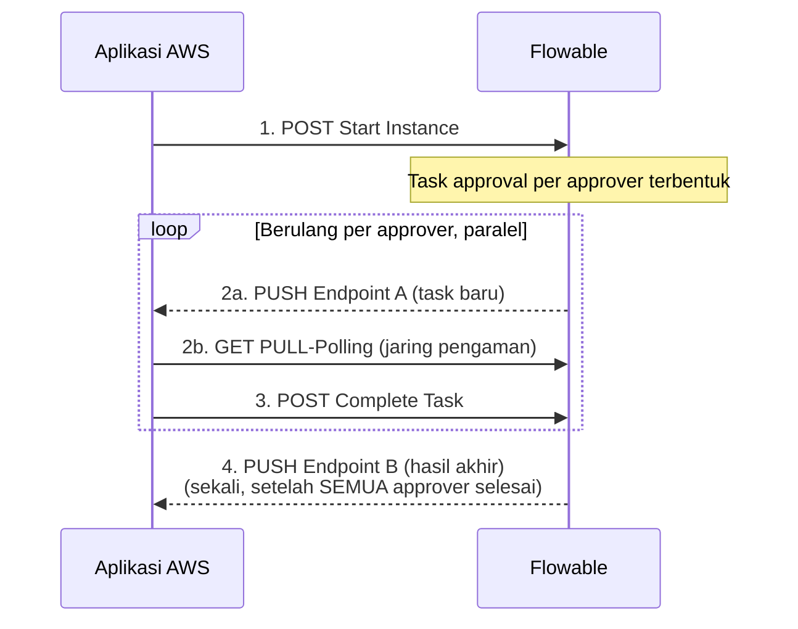

# Kontrak API — Ringkasan (Proses "Approval Berita Acara")

Dokumen ini adalah **cover/ringkasan singkat** dari dua dokumen kontrak
API untuk proses "Approval Berita Acara" antara Flowable dan **Aplikasi
AWS** (Agreement Workflow System — bukan Amazon Web Services, kebetulan
sama singkatannya) — bukan gabungan detail lengkapnya. Tujuannya supaya
siapa pun (mis. yang baru bergabung ke proyek) bisa cepat paham gambaran
besarnya sebelum masuk ke detail teknis di masing-masing dokumen:

| Dokumen | Isi | Arah panggilan |
|---|---|---|
| [KONTRAK-API-FLOWABLE.md](./KONTRAK-API-FLOWABLE.md) | 3 endpoint **wajib** yang **sudah tersedia** dari Flowable (Start Instance, PULL-Polling Task, Complete Task) + 10 endpoint monitoring & operasional tambahan **opsional** | Aplikasi AWS → Flowable |
| [KONTRAK-API-APLIKASI-AWS.md](./KONTRAK-API-APLIKASI-AWS.md) | 2 endpoint yang **harus dibangun** Aplikasi AWS (Endpoint A — Notifikasi Task Baru, Endpoint B — Callback Hasil Approval) | Flowable → Aplikasi AWS |

Untuk detail lengkap (skema field, contoh request/respons, kode error,
dsb.) selalu rujuk ke dokumen aslinya lewat tautan di atas — dokumen ini
sengaja tidak mengulang isi itu.

## Alur end-to-end

Push (langkah 2 & 4) bersifat **best-effort** (boleh gagal, tidak
menggagalkan proses) — PULL di langkah 2 adalah jaring pengaman resmi
yang **wajib** diimplementasikan Aplikasi AWS, bukan opsional.

## Daftar endpoint

| No. | Endpoint | Arah | Status | Detail |
|---|---|---|---|---|
| 1 | Start Instance | Aplikasi AWS → Flowable | Sudah tersedia | [KONTRAK-API-FLOWABLE.md §2](./KONTRAK-API-FLOWABLE.md#2-endpoint-start-instance) |
| 2 | PULL-Polling Task | Aplikasi AWS → Flowable | Sudah tersedia | [KONTRAK-API-FLOWABLE.md §3](./KONTRAK-API-FLOWABLE.md#3-endpoint-pull-polling-task) |
| 3 | Endpoint A — Notifikasi Task Baru | Flowable → Aplikasi AWS (PUSH) | **Harus dibangun** | [KONTRAK-API-APLIKASI-AWS.md §2](./KONTRAK-API-APLIKASI-AWS.md#2-endpoint-a--notifikasi-task-baru) |
| 4 | Complete Task | Aplikasi AWS → Flowable | Sudah tersedia | [KONTRAK-API-FLOWABLE.md §4](./KONTRAK-API-FLOWABLE.md#4-endpoint-complete-task) |
| 5 | Endpoint B — Callback Hasil Approval | Flowable → Aplikasi AWS (PUSH) | **Harus dibangun** | [KONTRAK-API-APLIKASI-AWS.md §3](./KONTRAK-API-APLIKASI-AWS.md#3-endpoint-b--callback-hasil-approval) |
| — | 10 endpoint monitoring & operasional tambahan (5 dasar: hitung task, detail task, status instance, variabel, audit trail — + 5 usulan tambahan: claim/delegate/resolve, batalkan instance, komentar, diagram, dead-letter job) | Aplikasi AWS → Flowable | Sudah tersedia, **opsional** | [KONTRAK-API-FLOWABLE.md §5](./KONTRAK-API-FLOWABLE.md#5-endpoint-monitoring--operasional-tambahan) |

## Risiko utama

| No. | Risiko | Sumber |
|---|---|---|
| 1 | `409 Conflict` kalau 2+ approver menyelesaikan task hampir bersamaan | [KONTRAK-API-FLOWABLE.md §6.1](./KONTRAK-API-FLOWABLE.md#61-risiko) |
| 2 | Start Instance gagal total kalau `jenisKlien` tidak persis salah satu dari 3 nilai yang didukung | [KONTRAK-API-FLOWABLE.md §6.1](./KONTRAK-API-FLOWABLE.md#61-risiko) |
| 3 | `ignoreException` (Endpoint B) belum dikonfirmasi valid di server produksi | [KONTRAK-API-APLIKASI-AWS.md §4](./KONTRAK-API-APLIKASI-AWS.md#4-risiko--hal-yang-belum-teruji-di-server-produksi) |
| 4 | Panggilan HTTP dari Task Listener (Endpoint A) belum diuji di server produksi | [KONTRAK-API-APLIKASI-AWS.md §4](./KONTRAK-API-APLIKASI-AWS.md#4-risiko--hal-yang-belum-teruji-di-server-produksi) |
| 5 | Endpoint A dipanggil sinkron — wajib dibangun cepat (<1 detik) | [KONTRAK-API-APLIKASI-AWS.md §4](./KONTRAK-API-APLIKASI-AWS.md#4-risiko--hal-yang-belum-teruji-di-server-produksi) |
| 6 | Endpoint A/B tidak pernah di-retry Flowable kalau gagal | [KONTRAK-API-APLIKASI-AWS.md §4](./KONTRAK-API-APLIKASI-AWS.md#4-risiko--hal-yang-belum-teruji-di-server-produksi) |

## Checklist implementasi

Checklist lengkap (11 item, mencakup kedua dokumen sekaligus) ada di satu
tempat: [KONTRAK-API-FLOWABLE.md §6.2](./KONTRAK-API-FLOWABLE.md#62-checklist-implementasi--pengujian) —
tidak diulang di sini supaya tidak ada dua sumber kebenaran untuk hal
yang sama.
